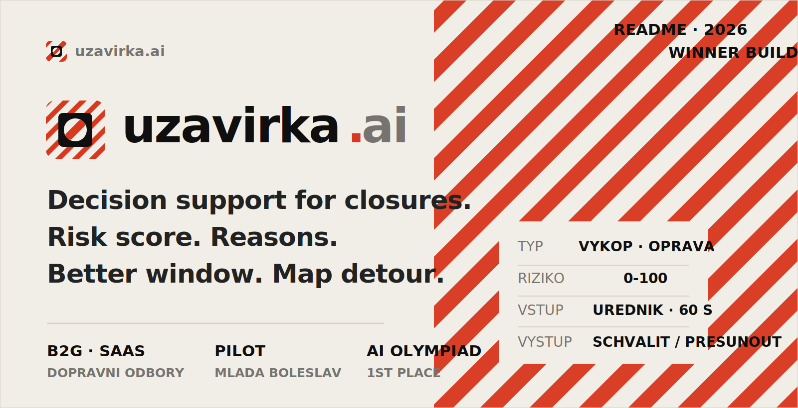
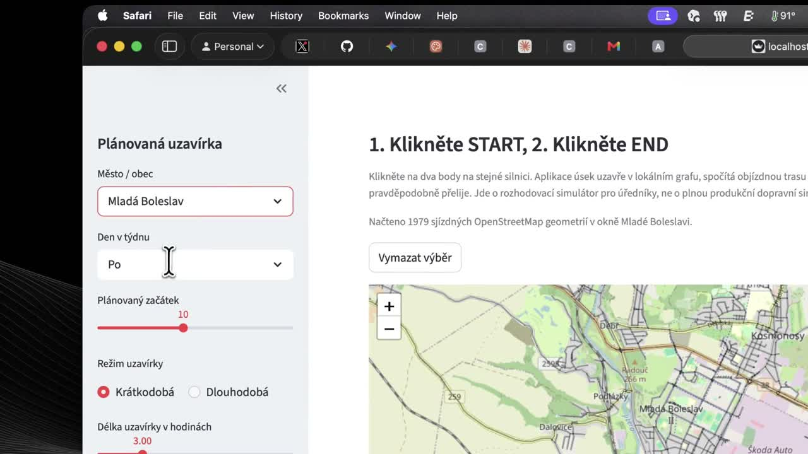
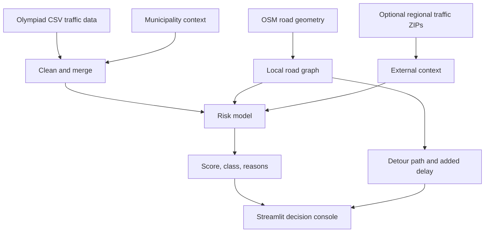

<p align="center">
  
</p>

# Uzavirka AI

**From permit guesswork to risk-ranked closure decisions in 60 seconds.**

Uzavirka AI is a first-place hackathon project from the AI Startup track at the Czech AI Olympiad regional round. It is a decision-support simulator for municipal road closures: an officer picks the planned closure, the app scores the risk, explains the drivers, finds a better time window, and shows the likely detour pressure on a map.

Built for **Stredocesky kraj**. Piloted on **Mlada Boleslav**. Designed to scale to every ORP city that approves roadworks, repairs, and temporary closures.

<p align="center">
  <a href="assets/uzavirka-ai-demo.mp4"><strong>Watch demo</strong></a>
  ·
  <a href="assets/uzavirka-ai-pitchdeck.pdf"><strong>Open pitch deck</strong></a>
  ·
  <a href="TECHNICAL_OVERVIEW.md"><strong>Read technical overview</strong></a>
  ·
  <a href="https://www.aiolympiada.cz/krajska-kola"><strong>Competition page</strong></a>
</p>

## The Problem

Road closures are approved with too much fragmented context. A transport officer may know the location and the planned time, but the real decision depends on traffic intensity, peak-hour pressure, public transport alternatives, P+R capacity, safety risk, and whether a reasonable detour exists.

Bad timing turns a necessary repair into avoidable congestion.

```text
wrong closure window = wasted commuter hours + delayed buses + political heat
```

## The Product

Uzavirka AI turns one planned closure into a clear operating decision.

| Input | AI-assisted output |
| --- | --- |
| City, road segment, day, start hour, duration, closure type | Risk score from `0` to `100` |
| Bus impact and local traffic context | Ranked reasons behind the score |
| START and END clicks on the map | Closed segment, detour path, added travel time |
| Current planned window | Safer alternative time windows |
| Available data quality | Confidence and manual-review warning |

The app does not automatically approve or reject permits. It gives officials an explainable recommendation they can challenge.

## Demo

[](assets/uzavirka-ai-demo.mp4)

| Asset | Link |
| --- | --- |
| Product demo video | [`assets/uzavirka-ai-demo.mp4`](assets/uzavirka-ai-demo.mp4) |
| Competition pitch deck | [`assets/uzavirka-ai-pitchdeck.pdf`](assets/uzavirka-ai-pitchdeck.pdf) |
| Technical write-up | [`TECHNICAL_OVERVIEW.md`](TECHNICAL_OVERVIEW.md) |
| Technical PDF | [`TECHNICAL_OVERVIEW.pdf`](TECHNICAL_OVERVIEW.pdf) |

## Why It Won

| Judging angle | What Uzavirka AI shows |
| --- | --- |
| Real regional problem | Municipal closures are a recurring approval workflow, not a one-off app idea. |
| Concrete buyer | ORP cities, municipal transport departments, and silnicni spravni urady. |
| Visible AI value | Transparent risk scoring, explanation, alternative-window ranking, and route-impact simulation. |
| Practical demo | Mlada Boleslav OSM map picker with START/END snapping and recomputed detour. |
| Ethical boundary | Advisory output, confidence notes, aggregate data, and manual review for weak data. |
| Business path | B2G SaaS with setup fees for local data integration and regional reporting. |

## How It Works



## Risk Model

The MVP uses a transparent traffic-vulnerability model. Each score is explainable and bounded.

Risk drivers:

- vehicle count
- traffic flow index
- average speed versus free speed
- morning or afternoon peak hour
- collision-risk index
- public transport alternatives
- P+R capacity
- closure duration
- closure type multiplier
- bus route impact
- selected map detour impact, capped at 10 points
- optional external traffic context, capped at 5 points

| Score | Class | Recommendation |
| ---: | --- | --- |
| `0-30` | LOW | Approve |
| `31-60` | MEDIUM | Approve with mitigation |
| `61-80` | HIGH | Reschedule or require strong mitigation |
| `81-100` | CRITICAL | Do not approve without major changes |

## Route Simulation

For the Mlada Boleslav demo, the app uses cached OpenStreetMap road geometry:

1. Officer clicks START on the map.
2. Officer clicks END on the same road.
3. Python snaps both clicks to the nearest road coordinate.
4. The selected road section is removed from a local `networkx` graph.
5. The app recomputes the shortest available detour.
6. Added time and distance feed back into the risk score and delay forecast.

Map language:

- **red** = closed road section
- **orange** = affected graph edges
- **green** = recomputed detour

## Data

Main AI Olympiad data:

- `01_provoz_useky_gps.csv`
- `02_obce_kontext.csv`
- `03_simpleml_komplet.csv`

Optional external context:

- `DOPR_D_YYYYMMDD.zip` regional traffic files
- cached Mlada Boleslav OSM road geometries in `data/mlada_boleslav_osm_roads.json`

Production upgrade path:

- NDIC / DATEX incidents, restrictions, and roadworks
- PID GTFS public transport alternatives
- municipal closure history and approval outcomes
- school calendars, large employer shift timing, and local events
- post-closure feedback and calibration

## Stack

| Layer | Tools |
| --- | --- |
| UI | Streamlit, folium, streamlit-folium, pydeck |
| Data | pandas, robust CSV normalization |
| Routing | networkx, OSM road graph |
| Model | transparent weighted scoring plus bounded context adjustments |
| Tests | pytest / unittest |

## Quickstart

```bash
pip install -r requirements.txt
streamlit run app.py
```

Run tests:

```bash
pytest
```

## Repository Map

```text
app.py                         Streamlit decision console
data_loading.py                CSV loading, normalization, validation
risk_model.py                  Risk score, recommendations, delay forecast
route_analysis.py              Synthetic and OSM-backed route simulation
osm_roads.py                   Mlada Boleslav OSM fetch/cache logic
external_data.py               Optional traffic ZIP parser
tests/                         Unit tests
assets/                        Brand assets, pitch deck, demo video
TECHNICAL_OVERVIEW.md          Detailed technical write-up
```

## Limits

This is a hackathon MVP, not production permitting infrastructure. It does not yet include historical closure-outcome labels, calibrated prediction intervals, live traffic ingestion, full turn restrictions, or a validated city-scale traffic model. Its role is to prove a sharper workflow: make the risk visible before the closure is approved.

## Business Model

Uzavirka AI is best sold as B2G SaaS for ORP cities and municipal transport departments, with setup fees for local data integration and optional regional reporting. The value is fewer badly timed closures, lower social delay costs, better bus reliability, and a reusable evidence base for transport planning.
