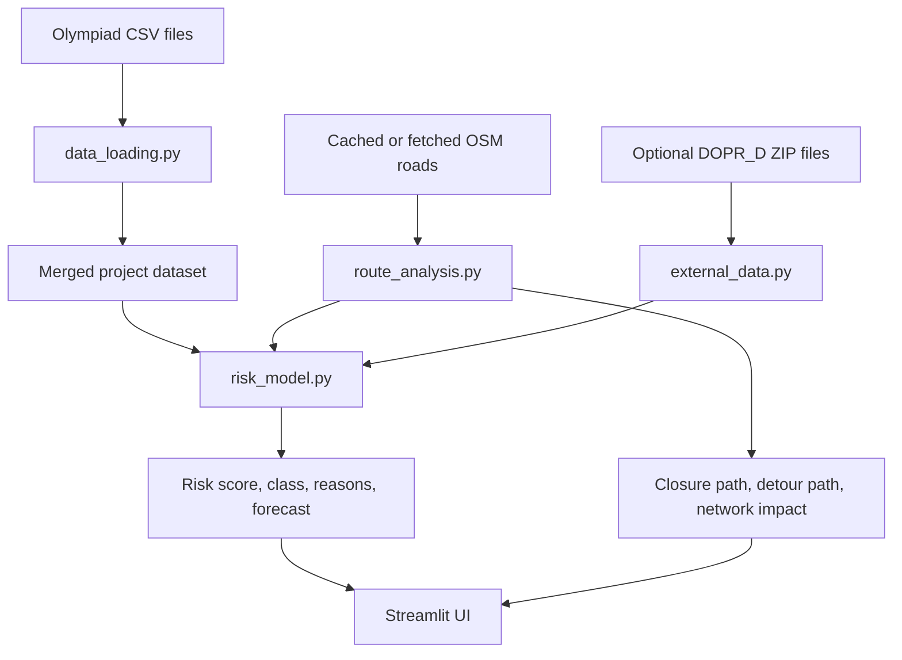

# Uzavirka AI

**1st place hackathon project for the AI Startup track at the Czech AI Olympiad regional round.**

Uzavirka AI is a decision-support simulator for municipal road closures in Stredocesky kraj. It helps a city officer decide whether a planned closure should be approved, moved to a better time window, or escalated for mitigation before it creates avoidable congestion.

[Watch demo video](assets/uzavirka-ai-demo.mp4) · [Open pitch deck](assets/uzavirka-ai-pitchdeck.pdf) · [Technical overview](TECHNICAL_OVERVIEW.md)

[](assets/uzavirka-ai-demo.mp4)

## Why It Matters

Municipal road closures are usually approved with fragmented context: traffic intensity, public transport alternatives, road safety, P+R capacity, timing, and local detours are reviewed separately or manually. A bad closure slot can create delay for thousands of commuters even when the work itself is necessary.

Uzavirka AI turns the approval moment into a measurable decision:

```text
closure risk = traffic vulnerability + timing pressure + safety risk + detour impact + weak alternatives
```

The output is not an automatic permit decision. It is an explainable recommendation for the human officer.

## What The App Does

An officer enters:

- city or municipality
- road segment or map-selected closure
- day of week
- planned start hour
- duration
- closure type
- whether bus service is affected

The app returns:

- risk score from `0` to `100`
- risk class and approval recommendation
- ranked explanation of the biggest risk drivers
- comparison against a simple peak-hour baseline
- better time-window suggestions
- estimated affected trips, people, delay, and avoidable delay
- local network impact: added distance, added travel time, affected edges, unreachable share
- ethics and confidence notes

## Competition Framing

The project was built for the Czech AI Olympiad regional round, whose AI Startup track asks three-person teams to design an AI solution for a regional assignment with business potential. Uzavirka AI is anchored in Stredocesky kraj and the first demo scenario is Mlada Boleslav, but the method is transferable to other ORP cities and regions.

## Demo Assets

| Asset | File |
| --- | --- |
| Demo video | [`assets/uzavirka-ai-demo.mp4`](assets/uzavirka-ai-demo.mp4) |
| Pitch deck | [`assets/uzavirka-ai-pitchdeck.pdf`](assets/uzavirka-ai-pitchdeck.pdf) |
| Technical overview | [`TECHNICAL_OVERVIEW.md`](TECHNICAL_OVERVIEW.md) |
| Technical overview PDF | [`TECHNICAL_OVERVIEW.pdf`](TECHNICAL_OVERVIEW.pdf) |

## Core Model

The MVP uses transparent traffic-vulnerability scoring rather than a black-box model. The score combines:

- vehicle count
- flow index
- average speed versus free speed
- morning or afternoon peak hour
- collision-risk index
- public transport alternatives
- P+R capacity
- closure duration
- closure type multiplier
- bus route impact
- selected map detour impact, capped at 10 points
- optional external traffic context, capped at 5 points

Risk classes:

| Score | Class | Recommendation |
| ---: | --- | --- |
| `0-30` | LOW | Approve |
| `31-60` | MEDIUM | Approve with mitigation |
| `61-80` | HIGH | Reschedule or require strong mitigation |
| `81-100` | CRITICAL | Do not approve without major changes |

## Route Simulation

For the Mlada Boleslav demo, the map picker uses OpenStreetMap road geometry:

1. The officer clicks a START point on the map.
2. The officer clicks an END point on the same road.
3. Python snaps both clicks to the nearest OSM road coordinate.
4. The selected road section is removed from a local `networkx` graph.
5. The app recomputes the shortest available detour.
6. The detour impact feeds back into the risk score and delay forecast.

The map colors are intentionally simple:

- red: closed segment
- orange: affected graph edges
- green: recomputed detour

## Data Sources

The MVP uses the AI Olympiad CSV files as the main dataset:

- `01_provoz_useky_gps.csv`
- `02_obce_kontext.csv`
- `03_simpleml_komplet.csv`

It also supports optional external traffic context from `DOPR_D_YYYYMMDD.zip` files published by the Dopravni portal Stredoceskeho kraje. These ZIP files are treated as bounded validation context, not as historical closure-outcome labels.

In production, the model should connect to:

- NDIC / DATEX roadworks, closures, incidents, and traffic events
- PID GTFS and public transport alternatives
- municipal closure history and approval outcomes
- school calendars, large-employer shift timing, and major events
- post-closure citizen and operator feedback

## Architecture



Runtime stack:

- Python
- Streamlit
- pandas
- networkx
- folium
- streamlit-folium
- pydeck
- pytest

## Quickstart

Install dependencies:

```bash
pip install -r requirements.txt
```

Run the app:

```bash
streamlit run app.py
```

Run tests:

```bash
pytest
```

## Repository Map

```text
app.py                         Streamlit UI and workflow
data_loading.py                CSV loading, normalization, and validation
risk_model.py                  Risk score, recommendations, delay forecast
route_analysis.py              Synthetic and OSM-backed route simulation
osm_roads.py                   Mlada Boleslav OSM fetch/cache logic
external_data.py               Optional traffic ZIP parser
tests/                         Unit tests
assets/                        Pitch deck, demo video, README thumbnail
TECHNICAL_OVERVIEW.md          Detailed technical write-up
```

## Limits

This is a hackathon MVP. It does not have historical closure-outcome labels, calibrated prediction intervals, live traffic ingestion, real turn restrictions, or a validated full-city traffic model. It should be read as a strong proof of concept for a municipal approval workflow, not as production-grade permitting automation.

## Business Model

The likely go-to-market is B2G SaaS for ORP cities and municipal transport departments, with setup fees for local data integration and optional regional reporting. The value is fewer badly timed closures, lower social delay costs, better bus reliability, and a reusable evidence base for future transport planning.
