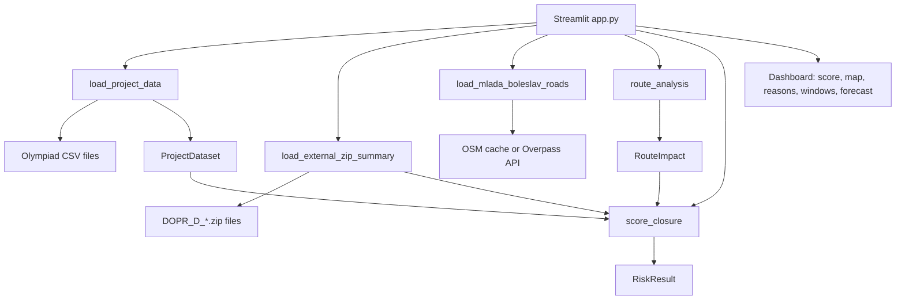

# Uzavírka AI Technical Overview

## 1. Purpose And Scope

Uzavírka AI is a local Streamlit MVP for municipal road-closure decision support in Středočeský kraj. It helps a municipal officer assess a planned road or lane closure before approval by estimating risk, explaining the main risk drivers, simulating local detour pressure, and suggesting lower-risk time windows.

The product is aimed at municipal transport departments, silniční správní úřady, and ORP cities. The first pilot scenario is Mladá Boleslav, with fixed demo support for Kladno, Kolín, Příbram, Beroun, and Mělník.

The system is deliberately scoped as a decision-support simulator. It is not a production navigation engine, not a validated full-city traffic model, and not an automatic approval system. Its output should guide human review rather than replace it.

## 2. Product Summary

The operator chooses a city, planned day, start hour, duration, closure type, and whether bus service is affected. The map then lets the operator identify a closure segment. The app returns:

- risk score from `0` to `100`
- risk class and approval recommendation
- confidence estimate
- network impact metrics
- likely detour path in the local graph
- ranked explanation of score contributors
- comparison against a simple peak-hour baseline
- better time-window suggestions
- traffic impact forecast and avoidable-delay estimate
- data quality and external ZIP-context report
- ethics note

There are two route-analysis modes:

- Mladá Boleslav can use cached or freshly fetched OpenStreetMap road geometries. The user clicks a START and END point, Python snaps both clicks to the nearest road coordinate, removes the selected road section from an OSM-backed graph, and recomputes the shortest available detour.
- Other demo cities use deterministic local synthetic geometry derived from city coordinates and segment labels. This supports stable demos even when real GIS geometry is unavailable.

## 3. Repository Structure

| Path | Role |
| --- | --- |
| `app.py` | Streamlit UI, app orchestration, map rendering, sidebar inputs, final dashboard output. |
| `data_loading.py` | Robust CSV reading, column normalization, numeric conversion, range clipping, context merge, quality report. |
| `risk_model.py` | Transparent closure-risk score, risk classes, recommendation mapping, ROI-style traffic forecast, better-window ranking. |
| `route_analysis.py` | Synthetic graph construction, route impact analysis, OSM closure path logic, snapping helpers, network dataclasses. |
| `external_data.py` | Optional `DOPR_D_*.zip` discovery, archive parsing, regional traffic context summary, bounded score adjustment. |
| `osm_roads.py` | Overpass API road fetch for Mladá Boleslav, cache read/write, road filtering. |
| `requirements.txt` | Python package dependencies. |
| `README.md` | Product-level overview and basic run instructions. |
| `tests/` | Unit tests for app helpers, data loading, external ZIP parsing, risk model, and route analysis. |
| `01_provoz_useky_gps.csv` | Main segment-level traffic dataset. |
| `02_obce_kontext.csv` | City/context dataset merged by `obec`. |
| `03_simpleml_komplet.csv` | Fallback/combined ML-style dataset. |
| `DOPR_D_*.zip` | Optional regional traffic ZIP files used as context only. |
| `data/mlada_boleslav_osm_roads.json` | Cached OSM road geometry for the Mladá Boleslav demo. |

## 4. Runtime Architecture



`app.py` is the only user-facing runtime entry point. It calls the lower-level modules and renders their outputs. The modules are mostly pure or side-effect-light, except for Streamlit state in `app.py`, optional OSM network access in `osm_roads.py`, and optional ZIP/file reads in `external_data.py`.

## 5. Install, Run, And Verify

Install dependencies:

```bash
pip install -r requirements.txt
```

Run the app:

```bash
streamlit run app.py
```

Run the test suite:

```bash
pytest -q
```

If `pytest` is not already installed in the active Python environment, install it separately:

```bash
python -m pip install pytest
```

Print a data quality report without launching Streamlit:

```bash
python data_loading.py
```

Current local verification:

```text
35 passed in 2.16s
```

A headless Streamlit launch was also verified with an explicit free port:

```bash
streamlit run app.py --server.headless true --server.port 8600
```

`python app.py` is not the clean app launch path. It can run in Streamlit bare mode and emit Streamlit-context warnings, but the supported runtime is `streamlit run app.py`.

## 6. Dependencies

Runtime dependencies from `requirements.txt`:

- `pandas>=2.2`
- `streamlit>=1.35`
- `pydeck>=0.9`
- `networkx>=3.3`
- `folium>=0.16`
- `streamlit-folium>=0.20`

The app also uses Python standard-library modules including `dataclasses`, `pathlib`, `json`, `zipfile`, `csv`, `xml.etree.ElementTree`, `urllib.request`, `urllib.parse`, `math`, `time`, and `html`.

There is no lockfile and the listed packages use lower-bound constraints only, so fresh installs can drift over time. `pytest` is required for local verification but is not currently listed in `requirements.txt`.

## 7. Data Inputs

### Required Olympiad CSVs

The loader expects at least one of the project CSV files:

- `01_provoz_useky_gps.csv`
- `02_obce_kontext.csv`
- `03_simpleml_komplet.csv`

The current repository has all three files in the project root. The app first looks in `data/`; if none of the expected CSVs exist there, it falls back to the project root.

Current root dataset shapes:

| File | Rows | Important columns |
| --- | ---: | --- |
| `01_provoz_useky_gps.csv` | 700 | `usek_id`, `obec`, `den_v_tydnu`, `hodina`, `volna_rychlost_kmh`, `pocet_vozidel_h`, `prum_rychlost_kmh`, `index_plynulosti_0_100`, `riziko_kolize_0_100` |
| `02_obce_kontext.csv` | 10 | `obec`, `pocet_obyvatel`, `dojizdejici_denne`, `spoju_den`, `kapacita_pr`, `podil_cest_autem_procent`, `prum_index_plynulosti`, `index_dostupnosti_0_100` |
| `03_simpleml_komplet.csv` | 700 | `obec`, `den_v_tydnu`, `hodina`, city context fields, `pocet_vozidel_h`, `index_plynulosti_0_100` |

### Optional ZIP Context

Files matching `DOPR_D_*.zip` are optional. `external_data.py` scans:

- repo root
- `data/`
- `external_data/`
- `downloads/`
- `opendata/`

The app currently calls `load_external_zip_summary(APP_DIR, max_files=3)`, so only the first three sorted candidate ZIPs affect the runtime summary.

ZIP files are not treated as historical closure outcome labels. They provide a bounded regional context adjustment only when compatible traffic fields show elevated disruption.

### Optional OSM Road Geometry

For Mladá Boleslav, `osm_roads.py` reads `data/mlada_boleslav_osm_roads.json` if the cache is fresh enough. If the cache is missing or stale, it tries Overpass API endpoints:

- `https://overpass-api.de/api/interpreter`
- `https://overpass.kumi.systems/api/interpreter`

If both fail, the app continues with the synthetic demo road fan.

## 8. Data Loading And Normalization

`data_loading.py` is responsible for turning messy CSV files into a model-ready `ProjectDataset`.

Main behavior:

- Reads CSVs with delimiter auto-detection through `pandas.read_csv(..., sep=None, engine="python")`.
- Tries encodings in this order: `utf-8`, `utf-8-sig`, `cp1250`, `latin1`.
- Normalizes column names by lowercasing, stripping accents, replacing non-alphanumeric spans with `_`, and trimming underscores.
- Converts known numeric columns using comma/period decimal handling.
- Fills missing numeric values with the median for that column, or `0` if the column has no valid numeric values.
- Clips numeric fields into plausible ranges, for example `hodina` to `0..23` and risk/index fields to `0..100`.
- Merges city context fields from `02_obce_kontext.csv` into traffic rows when both traffic data and `obec` are present.
- Prefers `01_provoz_useky_gps.csv` as the main dataset. If missing, it uses `03_simpleml_komplet.csv`.

The returned dataclass is:

```python
@dataclass
class ProjectDataset:
    data: pd.DataFrame
    reports: dict[str, dict]
    source_files: list[str]
```

Each report includes path, encoding, row count, normalized columns, missing counts, numeric columns converted, number of numeric values filled, and number of clipped values.

## 9. User Input And Selection Model

The UI supports a fixed city list:

- Mladá Boleslav
- Kladno
- Kolín
- Příbram
- Beroun
- Mělník

The sidebar inputs are:

- city / obec
- day of week: `Po`, `Út`, `St`, `Čt`, `Pá`, `So`, `Ne`
- planned start hour, `0..23`
- closure mode: short-term or long-term
- duration, expressed as active hours or days times active hours per day
- closure type
- whether a bus route is affected

Supported closure types:

| Internal value | UI label | Multiplier |
| --- | --- | ---: |
| `partial_lane_closure` | `Částečná uzavírka pruhu` | `0.90` |
| `detour` | `Objízdná trasa` | `1.08` |
| `full_road_closure` | `Úplná uzavírka silnice` | `1.18` |

`build_segment_options()` filters segment options by city when possible. If the selected city is not present in the data, it falls back to available segment data and lowers confidence. If `usek_id` is missing, it creates index-based labels such as `Segment 1`.

Mladá Boleslav has a special case: if the only available segment ID is `U01`, the UI expands it into a demo fan of named roads:

- `U01 Václava Klementa`
- `U01 Kosmonoská`
- `U01 Jičínská`
- `U01 Ptácká`
- `U01 Pražská`
- `U01 Nádražní`
- `U01 Laurinova`
- `U01 U Stadionu`

## 10. Route And Network Analysis

`route_analysis.py` models closures as graph operations. A route network is represented by:

```python
@dataclass(frozen=True)
class RoadNetwork:
    city: str
    points: pd.DataFrame
    edges: pd.DataFrame
```

The output of a closure analysis is:

```python
@dataclass(frozen=True)
class RouteImpact:
    closed_segment: str
    affected_edges: int
    extra_distance_km: float
    extra_time_min: float
    unreachable_share: float
    closure_edges: pd.DataFrame
    impacted_edges: pd.DataFrame
    detour_routes: pd.DataFrame
```

### Synthetic Graph Mode

For cities without usable OSM geometry, the app builds a small deterministic graph around the city center. Each segment gets:

- one main `closure` edge
- northern and southern detour edges
- connector edges between detour alternatives
- clickable snap points along the main path

The graph is a `networkx.DiGraph`. `analyze_closure()` computes the baseline shortest path, removes the selected closure edge, recomputes the shortest path, and reports:

- affected graph edges
- extra distance
- extra travel time
- share of sampled source-target pairs that become unreachable
- detour path geometry for map rendering

Edge travel time is derived from path distance and traffic stats. The weight uses speed, flow index, vehicle volume, and edge role.

### Mladá Boleslav OSM Mode

For Mladá Boleslav, OSM roads are used when available. The flow is:

1. Load cached OSM roads or fetch them from Overpass.
2. Render roads in a Folium map through `streamlit-folium`.
3. User clicks START.
4. User clicks END.
5. Python snaps each click to the nearest OSM road coordinate.
6. If both snapped points are on the same road, `osm_closure_path()` extracts the road section between those coordinates.
7. `analyze_osm_closure()` removes the matching directed graph edges and recomputes a detour.

The map colors are:

- red: selected closed section
- orange: impacted graph edges
- green: recomputed detour path
- START and END markers: snapped endpoints

If START and END are on different OSM roads, the app warns that exact closure computation is unavailable for that pair and asks the user to start a new same-road selection.

## 11. Risk Scoring Model

`risk_model.py` implements a transparent weighted vulnerability score.

The core dataclasses are:

```python
@dataclass
class RiskReason:
    name: str
    contribution: float
    explanation: str

@dataclass
class RiskResult:
    score: int
    risk_class: str
    recommendation: str
    reasons: list[RiskReason]
    baseline_class: str
    confidence: float
    roi: dict[str, float]
```

### Weighted Components

| Factor | Weight | Input signal |
| --- | ---: | --- |
| `Intenzita dopravy` | `0.20` | `pocet_vozidel_h` |
| `Plynulost` | `0.18` | `100 - index_plynulosti_0_100` |
| `Rychlost` | `0.10` | ratio of `prum_rychlost_kmh` to `volna_rychlost_kmh` |
| `Dopravní špička` | `0.12` | planned hour |
| `Bezpečnost` | `0.15` | `riziko_kolize_0_100` |
| `Alternativa veřejnou dopravou` | `0.08` | lower `spoju_den` raises risk |
| `Alternativa P+R` | `0.05` | lower `kapacita_pr` raises risk |
| `Délka uzavírky` | `0.12` | duration, sublinear scaling |

Peak-hour risk is:

- `100` for `7`, `8`, `9`, `15`, `16`, `17`, `18`
- `55` for `6`, `10`, `14`, `19`
- `15` otherwise

After weighted scoring:

- closure-type multiplier is applied
- bus-route impact adds `8` points
- network impact can add up to `10` points
- external ZIP context can add up to `5` points
- final score is clamped to `0..100`

### Risk Classes And Recommendations

| Score range | Class | Recommendation |
| --- | --- | --- |
| `0..30` | `LOW` | `Schválit.` |
| `31..60` | `MEDIUM` | `Schválit s opatřeními.` |
| `61..80` | `HIGH` | `Přesunout termín nebo vyžadovat silná opatření.` |
| `81..100` | `CRITICAL` | `Neschvalovat bez zásadních změn.` |

### Baseline Comparison

The baseline intentionally uses only time of day:

- peak hour -> `HIGH`
- shoulder hour -> `MEDIUM`
- off-peak -> `LOW`

This makes the app explain why the main model is more specific: it incorporates segment traffic, speed, flow, safety risk, duration, closure type, mobility alternatives, bus impact, network impact, and optional external context.

### Confidence

`score_closure()` estimates confidence from how many core traffic fields are present. `app.py` further caps confidence based on selection quality:

- exact city match raises confidence
- exact segment match raises confidence
- fallback city/segment selection lowers confidence

The maximum displayed confidence is `90%`.

## 12. Better Time Windows

`recommend_better_windows()` searches rows for the same city, optional same `usek_id`, and same day when available. It scores candidate rows with the same closure parameters and returns the lowest-risk windows.

Sorting priority:

1. lower risk score
2. workday off-peak preference for `10:00..13:00`
3. earlier start hour

The app shows up to three candidate windows.

For long-term closures, the UI frames this as lower-risk daily work windows rather than a one-off approval time.

## 13. Traffic Impact Forecast

The app calls the forecast fields `roi`, but the values are operational traffic-impact estimates rather than a full financial ROI model.

The forecast is based on:

```text
affected_trips = vehicle_count_per_hour * active_hours
affected_people = affected_trips * 1.2
person_delay_hours = affected_people * delay_minutes_per_trip / 60
```

Delay per trip is the larger of:

- risk-class assumption
- route simulation's added travel time

Risk-class delay assumptions:

| Class | Delay minutes |
| --- | ---: |
| `LOW` | `2` |
| `MEDIUM` | `5` |
| `HIGH` | `10` |
| `CRITICAL` | `20` |

The app also reports:

- low/base/high person-delay range
- extra vehicle-kilometers from selected detour distance
- forecast confidence
- avoidable delay hours if impact is reduced by `30%`

## 14. External ZIP Handling

`external_data.py` creates this dataclass:

```python
@dataclass(frozen=True)
class ExternalZipSummary:
    zip_count_loaded: int
    parsed_files: list[str]
    file_types: dict[str, int]
    total_record_count_estimate: int
    date_range: tuple[str | None, str | None]
    detected_columns_or_keys: list[str]
    warnings: list[str]
    usable_for_context: bool
    external_context_level: str
    risk_adjustment: int
    reason: str | None
    zip_files: list[str]
```

Archive members are parsed when their suffix is:

- `.csv`
- `.json`
- `.xml`
- `.txt`

CSV parsing handles comma-delimited data and pipe-delimited headerless Dopravní portal rows. Headerless DOPR rows are assigned these known columns:

- `IdDetektor`
- `DatumCas`
- `Intenzita`
- `IntenzitaN`
- `Obsazenost`
- `Rychlost`
- `Stav`
- `TypVozidla`
- `Trvani100`
- `RychlostHistorie`
- `TypVozidla10`

Traffic signals are inferred from:

- low speed: `Rychlost < 20`
- high occupancy: `Obsazenost > 70`
- non-OK state: `Stav != 0`

Context level:

- `HIGH`, `+5`: at least `100` elevated records or at least `10%` elevated share
- `MEDIUM`, `+3`: at least `20` elevated records or at least `3%` elevated share
- `LOW`, `+0`: otherwise

If ZIP files are present but incompatible or malformed, warnings are surfaced and the app continues without using them for scoring.

## 15. UI And State Behavior

Streamlit caching:

- `cached_data()` caches the loaded `ProjectDataset`.
- `cached_external_summary()` caches the external ZIP summary.
- `cached_mlada_boleslav_roads()` caches OSM road loading in the app process.

Session state:

- Mladá Boleslav OSM selection stores snapped START/END points under a city-specific key.
- A third click after START and END resets the OSM selection to a new START.
- Synthetic pydeck selection stores the currently selected map segment under a city-specific key.

The main dashboard sections are:

1. route picker
2. risk score metrics
3. network impact metrics
4. reasons and contribution bar chart
5. baseline comparison
6. better windows
7. traffic forecast
8. data quality report
9. ethics note

## 16. Testing

The test suite currently covers:

- robust CSV loading with decimal commas, semicolon delimiters, medians, and context merge
- fixed city options and segment-selection fallback behavior
- confidence lowering for fallback selection
- road network construction and path data conversion
- Streamlit selection payload parsing
- risk-score class boundaries
- recommendation output and reasons
- external ZIP parsing, invalid ZIP handling, headerless DOPR columns, and max-file behavior
- network-impact and external-context score caps
- OSM point snapping, same-road closure extraction, click reset behavior, detour calculation, and unreachable closure behavior

Current verified command:

```bash
pytest -q
```

Result:

```text
35 passed in 2.16s
```

## 17. Known Limitations

- There are no historical closure-outcome labels, so the score is a transparent heuristic rather than a trained and validated predictive model.
- Detour routes are local graph estimates, not guaranteed navigation routes.
- Synthetic geometry is useful for demos but should be replaced by production GIS data.
- OSM closure analysis requires START and END on the same OSM way for exact selected-section removal.
- The ZIP context is regional and bounded; it is not causal evidence that a specific closure will fail.
- The app does not model signal timing, queue spillback, full multimodal routing, school calendars, weather, incident feeds, or live navigation demand.
- Low-data or unusual cases should be manually reviewed.
- There is no packaged deployment configuration, CI pipeline, or production authentication layer in this repository.
- `requirements.txt` is runtime-oriented; test tooling is not pinned with the app dependencies.

## 18. Production Data Plan

A production version should replace or augment demo inputs with:

- historical closure approvals and actual disruption outcomes
- municipal and regional closure calendars
- NDIC or DATEX roadworks, incidents, and live traffic feeds
- PID GTFS and public-transport disruption data
- real GIS road centerlines and turn restrictions
- school calendars and major employer shift schedules
- event calendars and seasonal traffic patterns
- citizen feedback after closures
- manual officer overrides and post-hoc decision notes

The most important modeling upgrade would be converting the transparent heuristic into a calibrated model trained against known closure outcomes while preserving explanations and confidence reporting.

## 19. Ethics And Governance

The MVP uses aggregate traffic and municipal context data. It does not track individuals.

Governance principles:

- The model is advisory.
- Human officers remain responsible for approval decisions.
- The app exposes explanations and confidence instead of a black-box result.
- Missing or low-quality data should trigger manual review.
- Optional external context is bounded so it cannot dominate the score.
- The system should avoid embedding unfair assumptions about neighborhoods or mobility-poor communities without explicit review.

For competition and demo purposes, the ethical stance is part of the technical design: explainability, bounded automation, aggregate-only data, and human override are built into the output contract.

## 20. Competition Framing

The clean demo story is:

1. A municipal officer is reviewing one planned closure in Mladá Boleslav.
2. The officer marks the affected section on the map.
3. Uzavírka AI estimates risk and shows why the timing is risky.
4. It recomputes likely detour pressure in a local graph.
5. It suggests lower-risk work windows.
6. It quantifies expected delay and avoidable disruption.
7. The officer uses the result to approve, mitigate, reschedule, or reject.

The project fits a narrow B2G decision workflow: one buyer, one repeated decision, one measurable AI component, and one credible local demo. It is built for Středočeský kraj but the method can transfer to other regions once local data integrations and validation labels exist.
